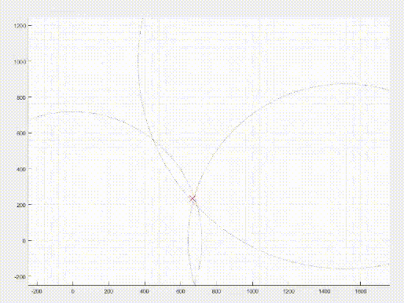

# DW1000 RTLS Project (STM32 Nucleo)

Ultra-wideband (UWB) ranging and localization firmware for STM32L476RG + Decawave DW1000 modules, with Python/Matlab host tools for live visualization and analysis.

This project was completed as a course project at the Faculty of Electrical Engineering, University of Ljubljana.

## At a Glance

- **Platform:** STM32 Nucleo-L476RG + DW1000
- **Scope:** Ranging, measurement campaigns, and 2D RTLS demo
- **Host tools:** Python (`pyserial`, `numpy`, `matplotlib`) and Matlab
- **Outcome:** End-to-end embedded-to-host UWB measurement pipeline

## Project Overview

This repository contains three related applications built around DW1000 two-way ranging:

- `DW_ranging_program`: point-to-point Anchor/Tag ranging with live distance output
- `DW_measurement_program`: automated measurement campaign for protocol/radio parameter sweeps
- `DW_RTLS_program`: 2D RTLS demo with 3 anchors + 1 tag and host-side visualization

The work demonstrates reliable embedded UWB communication, performance characterization across settings, and practical host-side data processing.

## Demo
The following demonstrates live data measurements of three anchors and a tag that is being moved between them.
Because the 3 anchors are used, position of the tag can be determined with triangulation.



## Repository Structure

| Path                      | Purpose                                               |
|---------------------------|-------------------------------------------------------|
| `DW_ranging_program/`     | Anchor/Tag ranging firmware + Python live plot script |
| `DW_measurement_program/` | Measurement firmware + Matlab sweep/analysis scripts  |
| `DW_RTLS_program/`        | Multi-anchor RTLS firmware + Matlab position plot     |
| `requirements.txt`        | Python dependencies for `show_meas_in_rt.py`          |

### Key Files

- `DW_ranging_program/show_meas_in_rt.py`: live plotting of streamed distance values
- `DW_measurement_program/Meritve/Matlab_code/serial_measurement.m`: serial-driven config sweep and statistics collection
- `DW_RTLS_program/Matlab_code/Matlab_rtls.m`: anchor-circle visualization and location estimation

## Hardware and Software Requirements

### Hardware

- STM32 Nucleo-L476RG boards
- DW1000 UWB modules
  - minimum: 2 nodes for basic ranging
  - RTLS demo: 4 nodes (3 anchors + 1 tag)
- USB cables and stable power for all nodes
- Known geometry/distances for repeatable tests

### Software

- Keil uVision (build `*.uvprojx` under each `DWM_project/MDK-ARM/`)
- STM32CubeMX / STM32 HAL-compatible project context
- Python 3 + packages from `requirements.txt`
- Matlab for measurement sweep and RTLS scripts

Install Python dependencies:

```bash
pip install -r requirements.txt
```

## Quick Start: `DW_ranging_program`

Goal: run two-node ranging and view live distance values.

1. Flash two boards from `DW_ranging_program/DWM_project/MDK-ARM/DWM_project.uvprojx`.
2. Set roles in `DW_ranging_program/DWM_project/Src/main.c`:
   - Anchor node: `w_dwtMode = DECA_MODE_ANCHOR`
   - Tag node: `w_dwtMode = DECA_MODE_TAG`
3. Connect to Anchor UART at `115200` baud.
4. Confirm output format:
   - `DIST: <value> m, TOC: <value> s`
5. In `DW_ranging_program/show_meas_in_rt.py`, set:
   - `ser.port` (e.g. `COM6` on Windows, `/dev/ttyACM0` on Linux)
   - optional plotting constants: `NUM_OF_MEASUREMENTS`, `MAX_DISTANCE`
6. Run the script and monitor real-time distance plotting.

## Measurement Workflow: `DW_measurement_program`

Goal: evaluate communication/ranging behavior across DW1000 configurations.

1. Flash `DW_measurement_program/DWM_project/MDK-ARM/DWM_project.uvprojx` to two nodes.
2. Set one node to Anchor and one to Tag in `DW_measurement_program/DWM_project/Src/main.c` via `w_dwtMode`.
3. Connect host serial to Anchor (`115200` baud).
4. In `DW_measurement_program/Meritve/Matlab_code/serial_measurement.m`, configure:
   - serial port (`serial('COM6', 'BaudRate', 115200)`)
   - sweep vectors (`channel_number_vec`, `prf_vec`, `data_rate_vec`, `prm_length_vec`, `payload`)
5. Run the script. It sends configuration commands, tracks state-machine responses, retries failures, and aggregates metrics:
   - measurement time mean/std
   - throughput estimate
   - receive/transmit ratio
   - RSSI estimate/spread
   - turnaround timing
   - error/status codes
6. Save `.mat` output and post-process with provided helpers.

## RTLS Workflow: `DW_RTLS_program`

Goal: localize one moving tag in 2D from three anchor distances.

Topology:

- Anchors: `DWT_ID_ANCHOR_0`, `DWT_ID_ANCHOR_1`, `DWT_ID_ANCHOR_2`
- Tag: `DWT_ID_TAG_0`

Runtime behavior:

- Tag ranges sequentially to all anchors and stores distance triplets
- Anchor 0 forwards measurements to host via UART (`MEAS_INCOMING` + 3x `uint16`)
- Matlab draws anchor circles and computes position from intersections

Setup:

1. Flash `DW_RTLS_program/DWM_project/MDK-ARM/DWM_project.uvprojx` to all four nodes.
2. In `DW_RTLS_program/DWM_project/Src/main.c`, set:
   - `w_dwtMode` (`DWT_MODE_ANCHOR` or `DWT_MODE_TAG`)
   - `w_dwtId` for each node
3. Connect host serial to Anchor 0 (`115200` baud).
4. In `DW_RTLS_program/Matlab_code/Matlab_rtls.m`, configure:
   - serial port (`serial('COM8', 'BaudRate', 115200)`)
   - `anchor_pos` matrix (anchor coordinates)
5. Run the Matlab script to view circles and estimated tag position in real time.

## Host Configuration Checklist

Edit these values before running host scripts:

| File                                                              | Required edits                                                    |
|-------------------------------------------------------------------|-------------------------------------------------------------------|
| `DW_ranging_program/show_meas_in_rt.py`                           | `ser.port`, `NUM_OF_MEASUREMENTS`, `MAX_DISTANCE`                 |
| `DW_measurement_program/Meritve/Matlab_code/serial_measurement.m` | serial port in `serial(...)`, optional sweep vectors, `start_ind` |
| `DW_RTLS_program/Matlab_code/Matlab_rtls.m`                       | serial port in `serial(...)`, `anchor_pos` matrix                 |

## Expected Serial/Host Behavior

- `DW_ranging_program`: human-readable distance/time lines
- `DW_measurement_program`: Matlab/firmware binary-status protocol (`MEASUREMENT_RES_INCOMING`, status/error bytes)
- `DW_RTLS_program`: Anchor 0 streams start byte + three 16-bit distances for continuous plotting

## What This Demonstrates

- Embedded communication design on STM32 + DW1000
- Interrupt-driven protocol/state-machine implementation
- UWB two-way ranging and time-of-flight distance estimation
- Multi-node data flow (Tag -> Anchors -> Host)
- Host-side acquisition/visualization in Python and Matlab
- Structured parameter-sweep experimentation and analysis

## Limitations and Future Work

- Antenna delay and geometric calibration are still basic/default
- Robustness validation is mostly manual (regression/soak tests are future work)
- Tooling remains tied to Keil/Cube-era layout (CMake + CI would improve portability)
- Host scripts are prototype-oriented and require manual serial-port setup
- No synchronized timestamp backend or probabilistic filter (for example, EKF) yet
